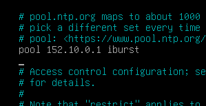
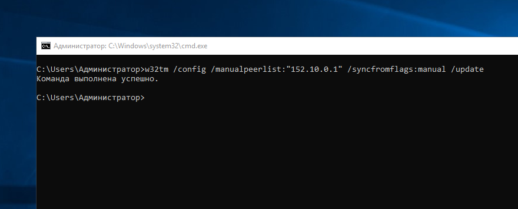
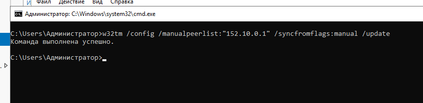

Моя топология выглядит вот так:


Нужно настроить NTP Сервер на:
- L-SRV (`152.10.0.1`) - Linux Server (Debian 12)

Так же нужно настроить клиентов на получение времени с сервера.

## Настройка NTP сервера

Устанавливаем пакет `ntpsec`
```bash
sudo apt update
sudo apt install ntpsec
```

Что бы настроить пакет `ntpsec` как сервер для нашей сети, надо в конец файла конфигруации..
```bash
sudo nano /etc/ntpsec/ntp.conf
```
..добавить несколько строк:
```conf
restrict 152.10.0.0 mask 255.255.0.0 nomodify notrap
```
Этой строчкой мы разрешим все подключения из сети 152.10/16

Теперь перезагружаем сервер
```bash
sudo systemctl restart ntpsec
```

## Настройка клиентов

### L-CLI

Устанавливаем пакет `ntpsec`
```bash
sudo apt update
sudo apt install ntpsec
```

В конфигурационном файле убираем все пулы...
```bash
sudo nano /etc/ntpsec/ntp.conf
```
... и добавляем наш сервер:
```conf
pool 152.10.0.1 iburst
```


### W-CLI

Запускаем в командной стройке от имени администратора:
```cmd
w32tm /config /manualpeerlist:"152.10.0.1" /syncfromflags:manual /update
```


### W-SRV

Запускаем в командной стройке от имени администратора:
```cmd
w32tm /config /manualpeerlist:"152.10.0.1" /syncfromflags:manual /update
```

