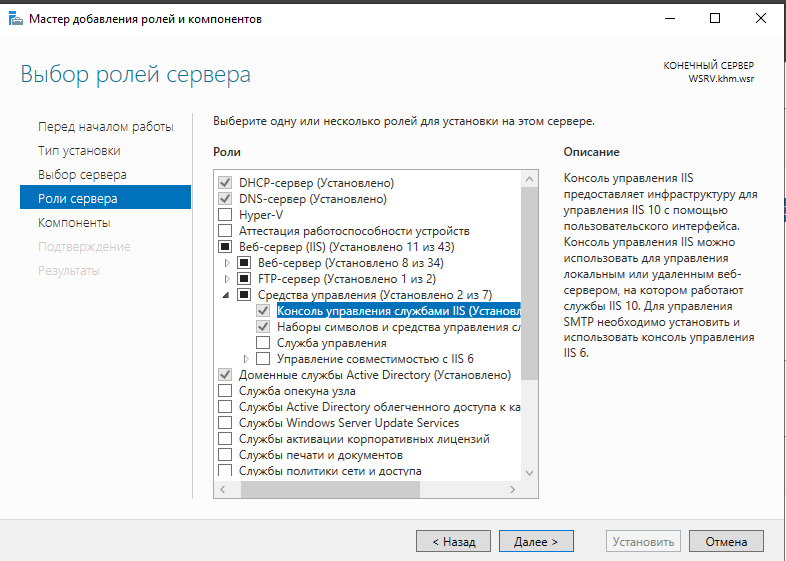
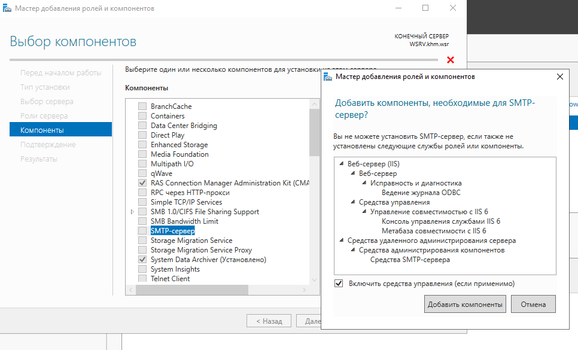
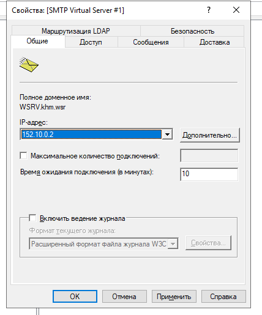
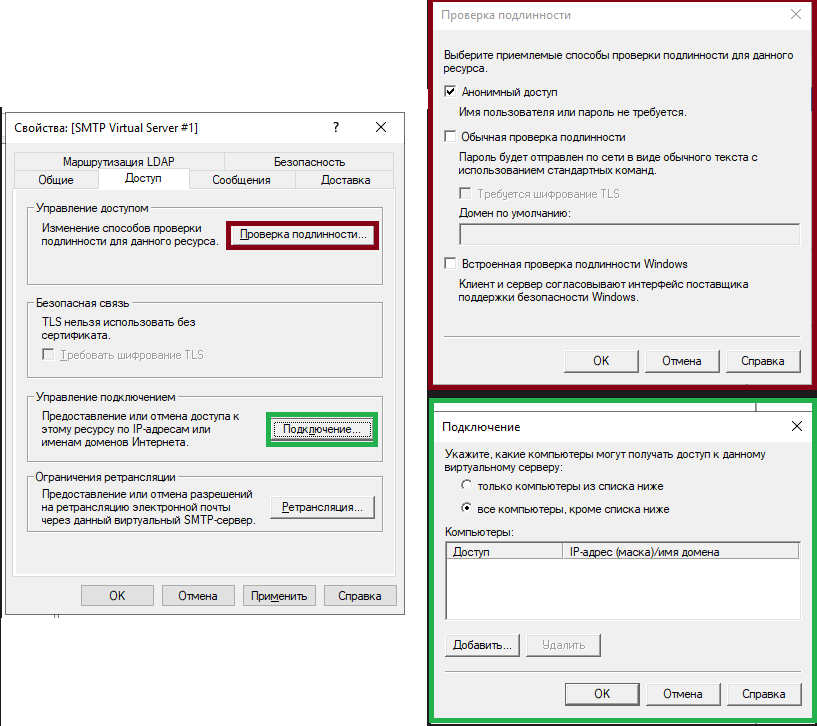
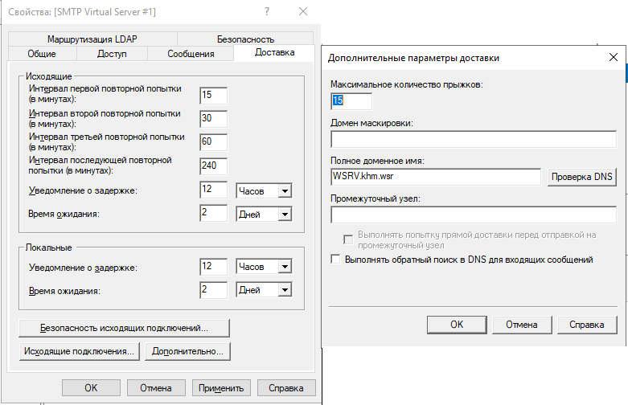
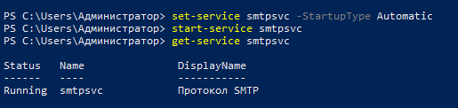
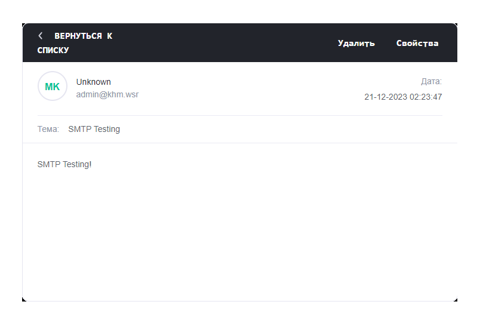

Моя топология выглядит вот так:


Настраивать SMTP будем на:
- W-SRV (`152.10.0.2`) - Windows Server 2019

### Установка сервера

Через добавление ролей и компонентов установим
- `Роли сервера`/`Консоль управления службами IIS`\
 
- `Компоненты`/`SMTP-Сервер`\


Ждём окончание установки (3-6 минуты)

### Настройка сервера

В целом, автоконфигурация уже достаточно преднастроена, если есть домен.\
Моя настройка:

\
\


Теперь нужно настроить что бы служба `SMTPSVC` запускалась автоматически
```powershell
set-service smtpsvc -StartupType Automatic
start-service smtpsvc
get-service smtpsvc
```


По пути `C:\inetpub\mailroot\Pickup` создаём наше "письмо"\
`mail.txt`:
```plain
From: admin@khm.wsr
To: totat22746@apdiv.com
Subject: SMTP Testing

SMTP Testing!
```


