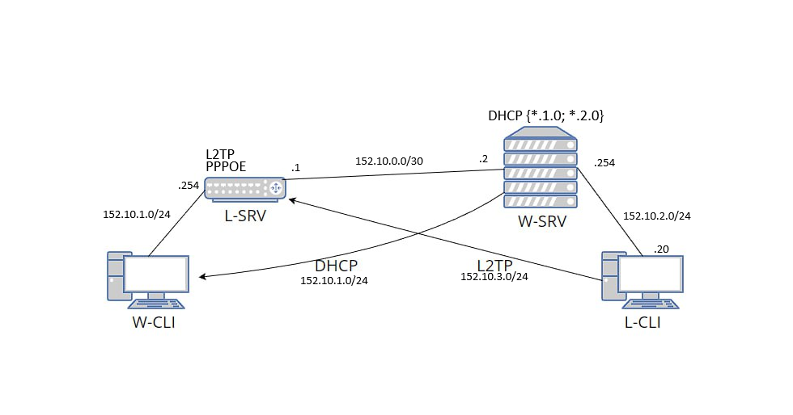
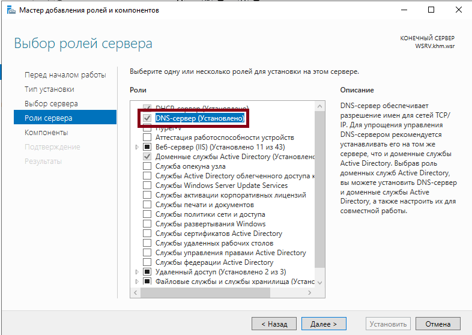
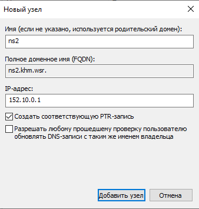
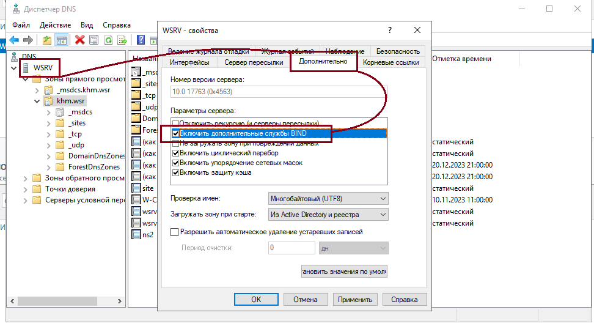
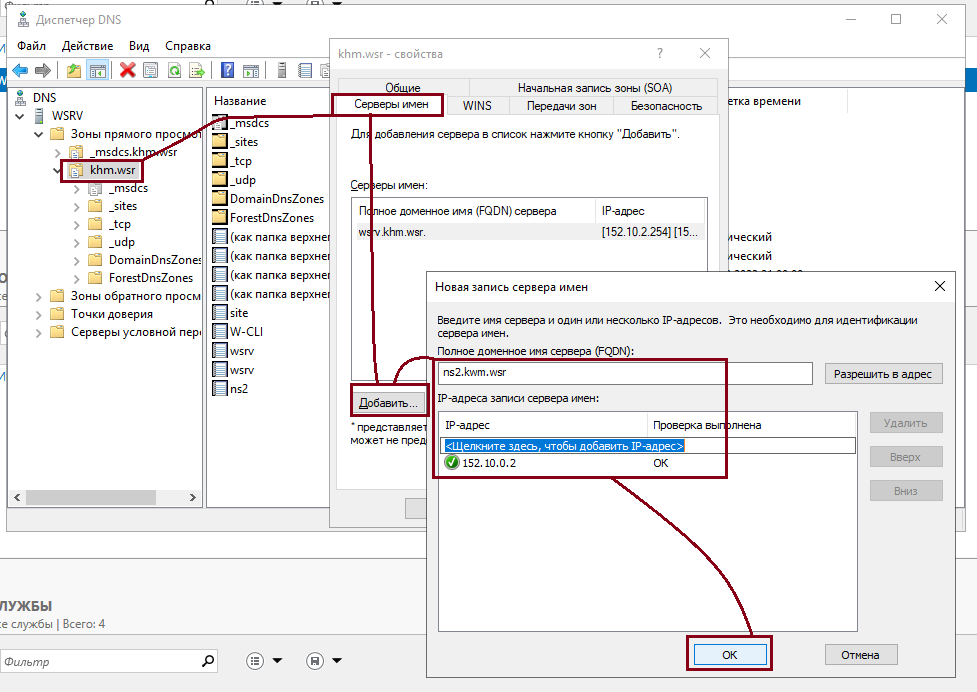
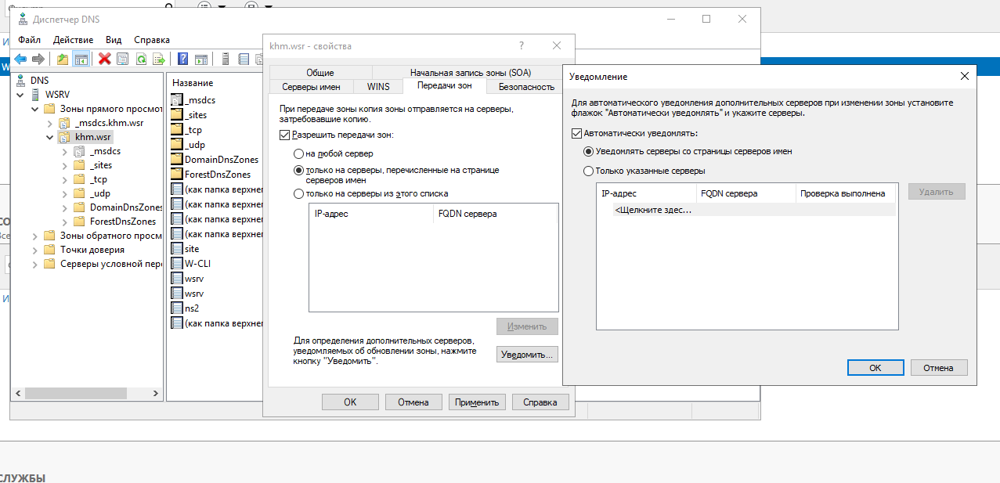
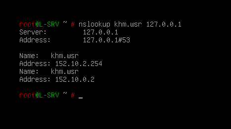

## Введение

Моя топология выглядит вот так:


Настраивать DNS будем на:
- L-SRV (`152.10.0.1`) - Linux Server (Debian 12)
- W-SRV (`152.10.0.2`) - Windows Server 2019

## Настройка Windows

Начнём с установки DNS на сервере:


Нажимаем далее, на всё соглашаемся.\
Дальше вы должны настроить DNS под свои нужды (создать хотя бы одну прямую зону), в моём случае уже стоит домен: `khm.wsr`.

Для начала нужно создать А запись `ns2.khm.wsr` с IP адресом `L-SRV`: `152.10.0.1`\


Правой кнопкой мыши заходим в `свойства` DNS, заходим во вкладку `Дополнительно`, и активируем `Включить дополнительные службы BIND`.\


Теперь заходим в свойства нашей прямой зоны, во вкладке `Серверы имён` добавляем `ns2.kwm.wsr`:


Не закрывая окно заходим во вкладку `Передачи зон`, активируем `Разрешить передачу зон` на `только серверы, перечисленные на странице сервером имён`.\
Далее нажимаем `Уведомить`, в открывшемся окне выбираем `Уведомлять серверы со страницы серверов имён`.\


**На этом с Windows пока что всё**

## Настройка Linux

Начнём с установки **BIND9**

```bash
sudo apt update
sudo apt install bind9 bind9utils nano dnsutils -y
```
`nano` и `dnsutils` - опцианальные пакеты\
`nano` - текстовый редактор.\
`dnsutils` - поможет траблшутинге такими командами как `nslookup` и `dig`.

Дальше делаем бекап файлов настройки, что бы в случае чего можно было к ним вернуться:
```bash
sudo cp /etc/bind/named.conf.local /etc/bind/named.conf.local.old
sudo cp /etc/bind/named.conf.options /etc/bind/named.conf.options.old
sudo cp /etc/bind/named.conf /etc/bind/named.conf.old
```

Открываем файл конфигурации:
```bash
sudo nano /etc/bind/named.conf.local
```
Вставлем в него установки для BIND
```bind
zone "<domain-name>" IN {
     type slave;
     file "/var/cache/bind/<filename>";
     masters { <master-server-ip>; };
};
```
`type slave;` - Значит что эта зона работает как **secondary**.\
`<domain-name>` - Это домен который мы настраиваем.\
`/var/cache/bind/<filename>` - Файл с записями зоны. (Нужно выбрать что-то логичное, что бы сразу было понятно для чего этот файл.)\
`<master-server-ip>` - IP-адрес главного сервера.

Дальше нужно добавить настройки для каждой зоны, которые есть на W-SRV DNS, по итогу мой файл выглядит вот так:
```bind
zone "khm.wsr" IN {
     type slave;
     file "/var/cache/bind/forward.khm.wsr.db";
     masters { 152.10.0.2; };
};

zone "_msdcs.khm.wsr" IN {
     type slave;
     file "/var/cache/bind/forward._msdcs.khm.wsr.db";
     masters { 152.10.0.2; };
};

zone "0.10.152.in-addr.arpa" IN {
     type slave;
     file "/var/cache/bind/reverse.khm.wsr.0.10.152.db";
     masters { 152.10.0.2; };
};

zone "1.10.152.in-addr.arpa" IN {
     type slave;
     file "/var/cache/bind/reverse.khm.wsr.1.10.152.db";
     masters { 152.10.0.2; };
};

zone "2.10.152.in-addr.arpa" IN {
     type slave;
     file "/var/cache/bind/reverse.khm.wsr.2.10.152.db";
     masters { 152.10.0.2; };
};
```

Перезапускаем `BIND` и проверяем результат:
```bash
sudo systemctl restart named
```

Прверить можно через `nslookup`:
```bash
nslookup khm.wsr 127.0.0.1
```

